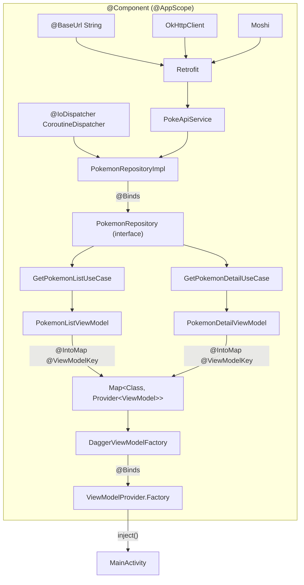
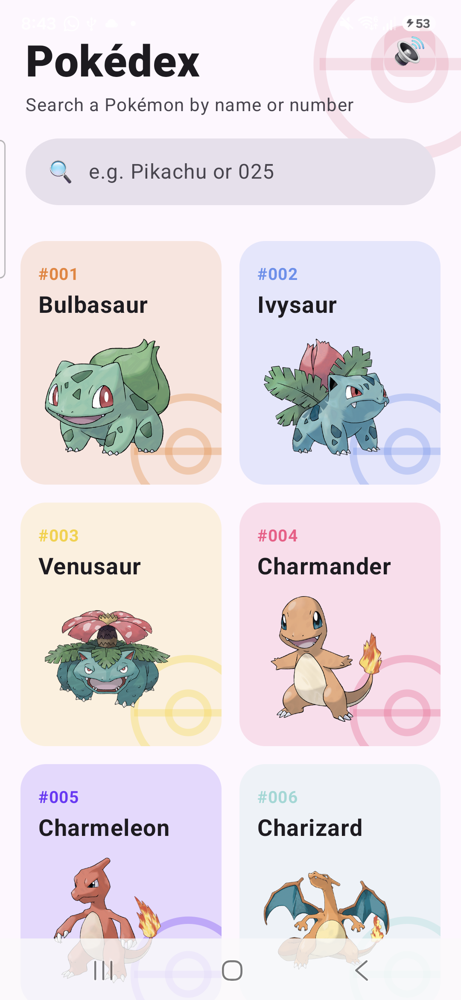

# Dagger Pokédex 🔴 — Dependency Injection with **Dagger 2**, explained

A small but complete Android app whose **only purpose is to teach how dependency
injection works with Dagger 2** — the real Dagger, wired by hand, **not Hilt**,
not Koin, not a service locator.

It fetches Pokémon from the public [PokéAPI](https://pokeapi.co), shows them in a
grid with **infinite scroll** (offset paging, 40 per page), and opens a scrollable
detail screen on tap with a proper Back behaviour. The feature is deliberately
simple so the **wiring** stays the star of the show. Every DI-related file is
heavily commented so you can learn the graph just by reading the code.

### UI highlights

- **Animated splash** — a spinning Poké Ball over a red gradient
  (`presentation/splash/SplashScreen.kt`), drawn entirely with Canvas (no image
  asset) via the reusable `components/Pokeball.kt`.
- **Home** — bold title, a live **client-side search** that filters the loaded
  list by name or number, and colorful rounded cards with a Poké Ball watermark.
- **Detail** — an immersive header tinted by the Pokémon's **primary type**
  (`presentation/theme/PokemonColors.kt`), overlapping artwork, type chips, and
  type-colored stat bars.
- **Shared-element transition** — tapping a card morphs its artwork and colored
  container into the detail header (`SharedTransitionLayout` + `AnimatedContent`,
  wired in `presentation/components/SharedTransition.kt`). The header renders from
  the tapped item immediately so the animation has a destination while the detail
  loads, and the card's color cross-fades to the real type color.
- **App icon** — an adaptive Poké Ball launcher icon drawn as vectors
  (`res/drawable/ic_launcher_*.xml`), including a monochrome layer for Android 13+
  themed icons and a circular fallback for API < 26.

<p align="center">
  <code>Kotlin</code> · <code>Jetpack Compose</code> · <code>Clean Architecture</code> ·
  <code>MVVM</code> · <code>Dagger 2</code> · <code>Retrofit/Moshi</code> · <code>Coroutines</code>
</p>

---

## Table of contents

1. [Why Dagger and not Hilt?](#why-dagger-and-not-hilt)
2. [Architecture overview](#architecture-overview)
3. [The dependency graph](#the-dependency-graph)
4. [Every Dagger annotation used, explained](#every-dagger-annotation-used-explained)
5. [The three hard parts, walked through](#the-three-hard-parts-walked-through)
6. [Project structure](#project-structure)
7. [Build & run](#build--run)
8. [Going further](#going-further)

---

## Why Dagger and not Hilt?

Hilt is Dagger with a lot of the boilerplate generated for you (`@HiltAndroidApp`,
`@AndroidEntryPoint`, predefined components and scopes). That is great for
production, but it **hides exactly the parts you need to understand**: how a
component is created, how modules contribute bindings, how scopes bound
lifetimes, and how a ViewModel gets injected.

This project wires everything **manually with Dagger 2** so nothing is magic:

| Concept | Hilt does it for you | Here we do it ourselves |
|---|---|---|
| Application component | `@HiltAndroidApp` | `@Component` + `DaggerAppComponent.factory().create()` |
| Activity injection | `@AndroidEntryPoint` | `appComponent.inject(activity)` |
| Scopes | `@Singleton`, `@ActivityScoped`… predefined | custom `@AppScope` we declare |
| ViewModel injection | `@HiltViewModel` | multibinding map + a `ViewModelProvider.Factory` |

Once you understand the manual version here, Hilt stops being magic — you will
know precisely what it generates on your behalf.

---

## Architecture overview

Strict **Clean Architecture** in three layers, with **MVVM** on the presentation
layer. Dependencies always point **inward** — outer layers know about inner
layers, never the reverse.

```
┌──────────────────────────────────────────────────────────────┐
│  presentation  (Android, Compose, MVVM)                       │
│  MainActivity · *Screen (Compose) · *ViewModel · *State       │
│        │ depends on ↓                                          │
├──────────────────────────────────────────────────────────────┤
│  domain  (pure Kotlin — no Android, no Retrofit)              │
│  Pokemon · PokemonDetail · PokemonRepository (interface)      │
│  GetPokemonListUseCase · GetPokemonDetailUseCase · Resource   │
│        ↑ implemented by │                                      │
├──────────────────────────────────────────────────────────────┤
│  data  (framework details)                                    │
│  PokeApiService (Retrofit) · DTOs · mappers ·                 │
│  PokemonRepositoryImpl                                         │
└──────────────────────────────────────────────────────────────┘
                    ▲
                    │ everything is wired together by
                    │
        ┌───────────────────────────┐
        │  di  (the Dagger graph)   │
        │  AppComponent · Modules   │
        └───────────────────────────┘
```

- **domain** is the center: it defines models, the `PokemonRepository`
  **interface**, and use cases. It has zero knowledge of Android or the network.
- **data** implements the domain's repository interface using Retrofit + Moshi,
  and maps network **DTOs** into clean **domain models**.
- **presentation** renders state with Compose. Each screen has a `ViewModel`
  (MVVM) that exposes an immutable `State` via `StateFlow`.
- **di** is the glue: Dagger modules and the component that build and connect all
  of the above.

The key inversion: `domain` declares `interface PokemonRepository`; `data`
provides `PokemonRepositoryImpl`; **Dagger connects the two** with `@Binds`, so no
layer ever hard-references a concrete class it shouldn't.

---

## The dependency graph

This is the object graph Dagger builds and manages for you. Arrows mean
"is injected into / is needed by".



**Read it bottom-up:** the Activity asks for a `ViewModelProvider.Factory`;
Dagger sees it needs the `DaggerViewModelFactory`, which needs the ViewModel map,
whose entries need use cases, which need the repository, which needs the API,
which needs Retrofit, which needs a base URL, an OkHttp client and Moshi. Dagger
resolves this entire chain at **compile time** and generates the code to build it
in the correct order.

---

## Every Dagger annotation used, explained

| Annotation | Where in this repo | What it does |
|---|---|---|
| `@Inject` (constructor) | `GetPokemonListUseCase`, `PokemonRepositoryImpl`, every `ViewModel`, `DaggerViewModelFactory` | Tells Dagger it can build the class by resolving the constructor parameters from the graph. No module needed. |
| `@Inject` (field) | `MainActivity.viewModelFactory` | For objects Android creates (Activities), Dagger fills annotated fields via **members injection**. |
| `@Module` | `AppModule`, `NetworkModule`, `RepositoryModule`, `ViewModelModule` | A container of provider methods — a "recipe book" for types Dagger can't build itself. |
| `@Provides` | `NetworkModule`, `AppModule` | A method whose **return value** Dagger uses to satisfy that type. Used for third-party types (Retrofit, OkHttp, Moshi) and values. |
| `@Binds` | `RepositoryModule`, `ViewModelModule` | Abstract, body-less: "when someone asks for interface X, give them impl Y" (which Dagger already knows how to build). Lighter than `@Provides`. |
| `@Component` | `AppComponent` | The graph root. Dagger generates `DaggerAppComponent`, which contains all wiring and exposes provision/injection entry points. |
| `@Component.Factory` | `AppComponent.Factory` | How you instantiate the component (and pass runtime values in, via `@BindsInstance`, if needed). |
| `@Scope` → `@AppScope` | `di/scope/AppScope.kt` | A custom scope. A type provided as `@AppScope` is created **once** and shared for the component's lifetime (here, the whole app). Equivalent in effect to `@Singleton`. |
| `@Qualifier` → `@BaseUrl`, `@IoDispatcher` | `di/qualifier/Qualifiers.kt` | Distinguishes two bindings of the **same type** (two `String`s, two `CoroutineDispatcher`s). Type-safe alternative to `@Named`. |
| `@IntoMap` + `@MapKey` → `@ViewModelKey` | `ViewModelModule`, `ViewModelKey.kt` | **Multibinding**: many modules contribute entries into one `Map`. We build `Map<Class<out ViewModel>, Provider<ViewModel>>` to inject ViewModels. |
| `Provider<T>` | `DaggerViewModelFactory` | Dagger's lazy factory: `provider.get()` builds a fresh, fully-injected `T` on demand — perfect for creating a ViewModel exactly when Android asks. |

---

## The three hard parts, walked through

### 1. `@Provides` vs `@Binds`

- **`@Provides`** — you write the body because Dagger can't build the type itself.
  Example: Retrofit is a third-party builder.
  ```kotlin
  @Provides @AppScope
  fun provideRetrofit(client: OkHttpClient, moshi: Moshi, @BaseUrl url: String): Retrofit =
      Retrofit.Builder().baseUrl(url).client(client)
          .addConverterFactory(MoshiConverterFactory.create(moshi)).build()
  ```
- **`@Binds`** — abstract and body-less; you only *rename* a type Dagger can
  already build (because it has an `@Inject` constructor) to an interface.
  ```kotlin
  @Binds @AppScope
  abstract fun bindPokemonRepository(impl: PokemonRepositoryImpl): PokemonRepository
  ```
  Rule of thumb: *need code to build it?* → `@Provides`. *Just mapping impl → interface?* → `@Binds`.

### 2. Qualifiers — telling two identical types apart

`provideBaseUrl()` returns a `String`, and so could a dozen other providers.
`@BaseUrl` tags this specific one, and the consumer asks for that tag:

```kotlin
@Provides @BaseUrl fun provideBaseUrl(): String = "https://pokeapi.co/api/v2/"

@Provides fun provideRetrofit(..., @BaseUrl baseUrl: String): Retrofit = ...
```

Same idea with `@IoDispatcher` for the `CoroutineDispatcher` used in
`PokemonRepositoryImpl`.

### 3. Injecting a ViewModel with pure Dagger (the famous one)

Android insists on creating ViewModels through a `ViewModelProvider.Factory`.
Dagger wants to build objects itself. We bridge them with **multibinding**:

1. Every ViewModel is contributed into a map, keyed by its class:
   ```kotlin
   @Binds @IntoMap @ViewModelKey(PokemonListViewModel::class)
   abstract fun bindListVm(vm: PokemonListViewModel): ViewModel
   ```
2. `DaggerViewModelFactory` receives that map and, when asked for a class, calls
   the matching `Provider` to build a fully-injected instance:
   ```kotlin
   class DaggerViewModelFactory @Inject constructor(
       private val creators: Map<Class<out ViewModel>, @JvmSuppressWildcards Provider<ViewModel>>,
   ) : ViewModelProvider.Factory {
       override fun <T : ViewModel> create(modelClass: Class<T>): T =
           creators.getValue(modelClass).get() as T
   }
   ```
3. `MainActivity` gets this factory via field injection and hands it to Compose's
   `viewModel(factory = …)`. Result: constructor-injected ViewModels, with Android
   still owning their lifecycle.

Adding a new screen is then a **one-line** change: give its ViewModel an
`@Inject` constructor and add one `@Binds @IntoMap @ViewModelKey(...)` entry.

---

## Project structure

```
app/src/main/java/com/example/daggerpokedex/
├── DaggerPokedexApp.kt          # Application: owns the AppComponent
├── di/                          # ← the Dagger graph (start reading here)
│   ├── AppComponent.kt          #   @Component: the graph root
│   ├── AppModule.kt             #   @Provides IO dispatcher
│   ├── NetworkModule.kt         #   @Provides Retrofit / OkHttp / Moshi / API
│   ├── RepositoryModule.kt      #   @Binds  impl → interface
│   ├── ViewModelModule.kt       #   @IntoMap ViewModel multibinding
│   ├── ViewModelKey.kt          #   @MapKey for the ViewModel map
│   ├── DaggerViewModelFactory.kt#   bridges Dagger ↔ Android ViewModel
│   ├── scope/AppScope.kt        #   custom @Scope
│   └── qualifier/Qualifiers.kt  #   @BaseUrl, @IoDispatcher
├── domain/                      # pure Kotlin business layer
│   ├── model/                   #   Pokemon, PokemonDetail
│   ├── repository/              #   PokemonRepository (interface)
│   ├── usecase/                 #   GetPokemonList / GetPokemonDetail
│   └── util/Resource.kt         #   Success / Error wrapper
├── data/                        # framework details
│   ├── remote/PokeApiService.kt #   Retrofit endpoints
│   ├── remote/dto/              #   JSON DTOs (Moshi)
│   ├── mapper/PokemonMappers.kt #   DTO → domain
│   └── repository/PokemonRepositoryImpl.kt
└── presentation/                # MVVM + Compose
    ├── MainActivity.kt          #   field injection + tiny nav host
    ├── list/                    #   ViewModel · State · Screen
    ├── detail/                  #   ViewModel · State · Screen
    ├── navigation/Screen.kt
    └── theme/Theme.kt
```

**Suggested reading order:** `DaggerPokedexApp` → `AppComponent` → `NetworkModule`
→ `RepositoryModule` → `ViewModelModule` + `DaggerViewModelFactory` →
`MainActivity`. Follow the comments; they narrate the graph.

---

## Build & run

**Requirements:** Android SDK (compileSdk 36). A JDK 17 toolchain is **downloaded
automatically** by Gradle (via the foojay resolver) if your machine only has a
newer JDK, so you don't need to install one manually.

```bash
# Build the debug APK
./gradlew :app:assembleDebug

# Run the unit tests (use case + ViewModel)
./gradlew :app:testDebugUnitTest

# Install on a connected device / emulator
./gradlew :app:installDebug
```

The APK is produced at `app/build/outputs/apk/debug/app-debug.apk`.

### Toolchain versions

| Tool | Version |
|---|---|
| Android Gradle Plugin | 8.13.0 |
| Gradle | 9.1.0 |
| Kotlin | 2.2.20 |
| KSP | 2.2.20-2.0.4 |
| Dagger | 2.57.2 |
| compileSdk / minSdk | 36 / 24 |

> **Why KSP and not kapt?** Dagger's annotation processor runs through **KSP**
> (Kotlin Symbol Processing), the modern, faster replacement for kapt. The
> `dagger-compiler` is attached with `ksp(...)` in `app/build.gradle.kts`, so it
> runs at build time only and never ships inside the APK.

---

## Going further

Ideas to extend the sample and explore more Dagger:

- **Subcomponents & custom scopes per feature.** Introduce an
  `@FeatureScope` subcomponent for the detail screen to see scoping across
  component boundaries.
- **`@AssistedInject`.** Formalize passing the runtime Pokémon name into
  `PokemonDetailViewModel` through the graph instead of the current `load(name)`
  call, using Dagger's assisted injection.
- **`@BindsInstance`.** Pass the Android `Context` (or a `BuildConfig` flag) into
  the graph via `AppComponent.Factory.create(@BindsInstance context: Context)`.
- **Preserve list scroll across navigation.** The list keeps its data when you
  return from the detail (the ViewModel is retained), but the grid scroll
  position resets to the top. Hoisting the `LazyGridState` or moving to
  Navigation-Compose with a back stack would keep it.

> **Already implemented:** infinite-scroll paging (see `PokemonListViewModel.loadNextPage`
> + the `reachedBottom` trigger in `PokemonListScreen`), a scrollable detail
> screen, and a `BackHandler` so system Back returns to the list instead of
> closing the app.

---

*Built as a teaching reference. Every file in `di/` is commented to be read like
a tutorial — clone it, open `AppComponent.kt`, and follow the graph.*

## Screenshots

<p align="center">
  
</p>
